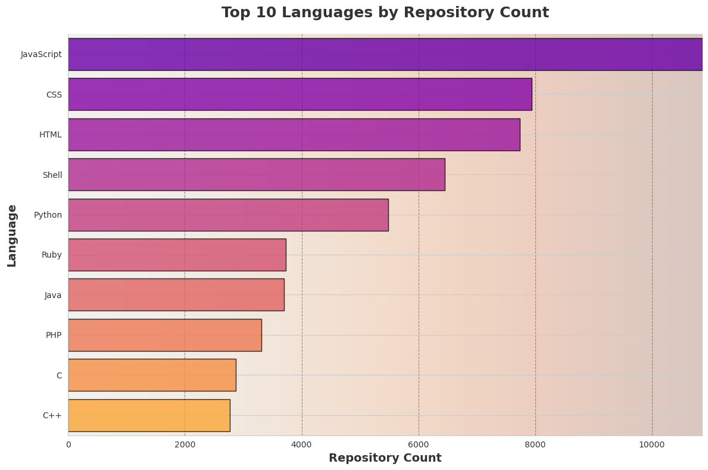
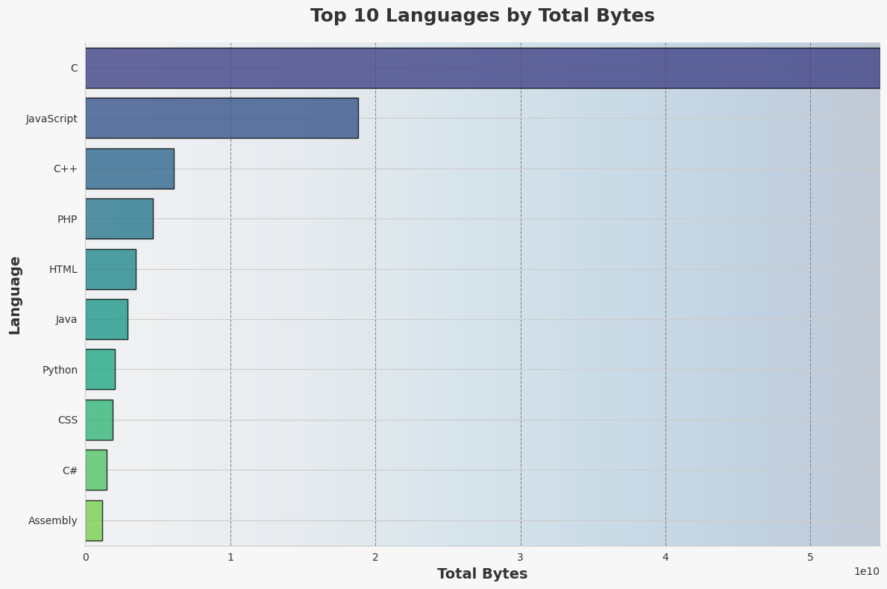
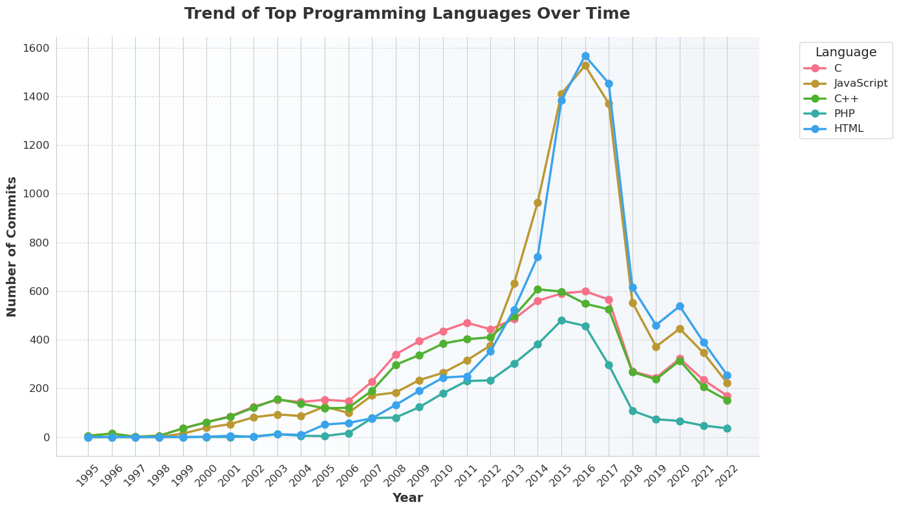
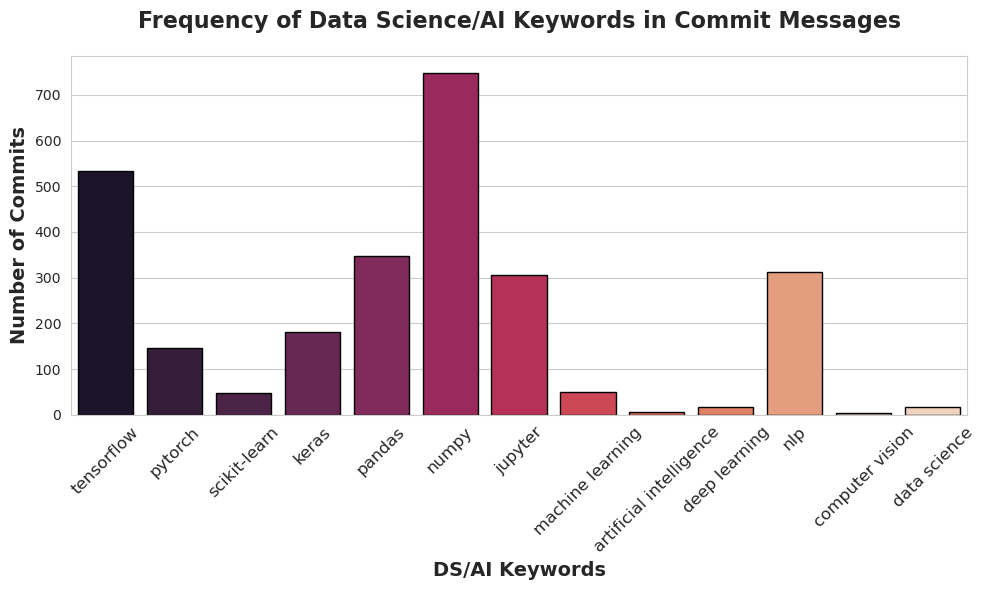
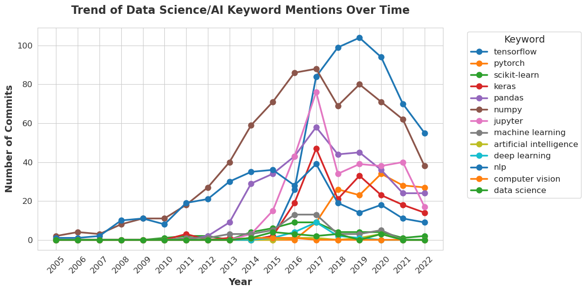
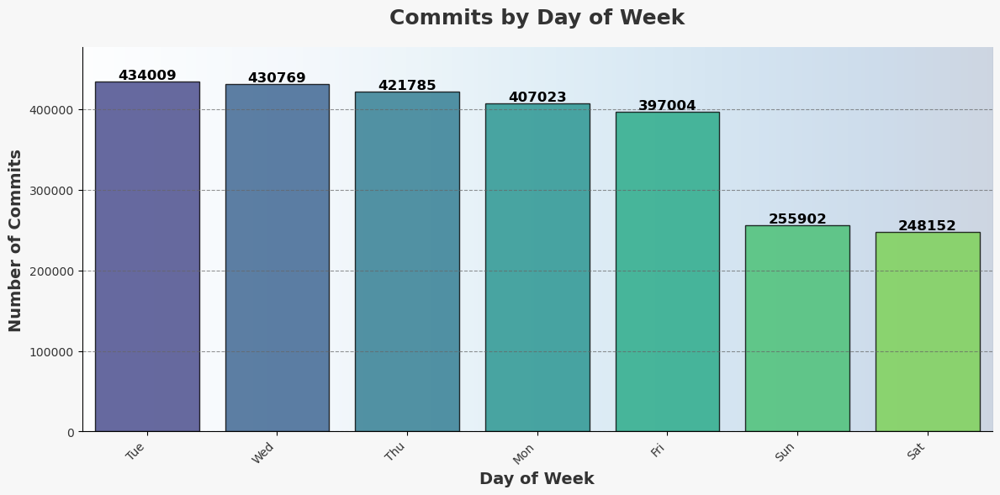
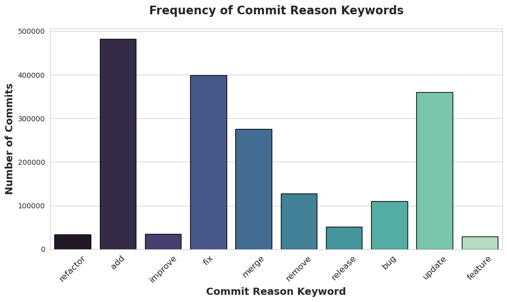

# Will TuringBots Replace Human Software Developers?
*A Big Data Analysis of Trends in Open Source Coding, Automation, and AI*

**By Hritik Jhaveri | Big Data and Cloud Computing**

---

## 🗂️ Overview

This project investigates whether AI-powered development tools—so-called “TuringBots”—are poised to replace human software developers. By mining trends from the GitHub Archive (over 1.36 TiB of commits and repository data), we analyze shifts in programming language usage, license adoption, automation, and the real impact of AI tools on the software development landscape.

---

## 🚀 Main Results & Visualizations

The analysis of over 1.36 TiB of GitHub data reveals several key trends shaping the software development industry.

#### 1. Programming Language Trends
JavaScript remains the most popular language by repository count, highlighting the dominance of web technologies. However, by volume of code, C is the largest, indicating its foundational role in large-scale systems. Python has firmly established itself as the leader in the AI/ML space.

<p align="center">
  
  
</p>
<p align="center">
  
</p>

#### 2. The Rise of AI and Data Science
The growth of AI and Data Science is explosive. "AI" is the most frequently mentioned technology keyword in commit messages, and Python's ecosystem of libraries (`numpy`, `tensorflow`, `pandas`) dominates this trend.

<p align="center">
  
  
</p>

#### 3. Automation and Developer Workflows
Commit patterns reveal a standard Monday-Friday work week, with activity peaking mid-week. Automation is a significant factor, with bots and CI/CD systems ranking among the top committers. This, along with the high frequency of templated commit messages, points to the increasing role of automation in the development lifecycle.

<p align="center">
  
  
</p>

---

## 💡 Conclusion

**TuringBots and AI tools will *augment*, not replace, human developers.** They excel at automating repetitive tasks, but humans remain indispensable for creative problem-solving, architectural design, and innovation. The future of software engineering is a collaborative one, where AI handles the rote work, and humans lead on complex and strategic decisions.

---

## 🗃️ Project Structure

The repository is organized to separate the data analysis notebooks from the visual outputs.

```
.
├── notebooks/              # Jupyter notebooks for data analysis.
│   ├── 1_Languages.ipynb
│   ├── 2_Commits.ipynb
│   └── ...
├── visualizations/         # Plots and charts generated by the notebooks.
│   ├── top_lang_repo.png
│   └── ...
├── .gitignore
├── LICENSE
├── README.md
└── requirements.txt
```

---

## 🏃‍♂️ How to Run the Analysis

To reproduce the analysis in this project, please follow these steps:

#### 1. Clone the Repository
```bash
git clone https://github.com/codex83/turingbots-ai-se.git
cd turingbots-ai-se
```

#### 2. Set Up the Environment
It is recommended to use a virtual environment.
```bash
python3 -m venv venv
source venv/bin/activate
pip install -r requirements.txt
```

#### 3. Data Access
This project runs on a 1.36 TiB dataset from the GitHub Archive, which is stored on Google Cloud Storage (GCS). The path to this dataset is hardcoded in the notebooks (`gs://msca-bdp-data-open/final_project_git`).

To run the notebooks, you will need:
-   An environment with access to Google Cloud Storage.
-   An Apache Spark cluster (like Google Cloud Dataproc) to handle the large-scale data processing.

#### 4. Execute the Notebooks
The analysis is split across several Jupyter notebooks in the `notebooks/` directory. It is recommended to run them in numerical order, as they follow the logical flow of the analysis:
1.  `1_Languages.ipynb`: Analyzes language popularity and trends.
2.  `2_Commits.ipynb`: Analyzes commit patterns, seasonality, and keyword trends.
3.  ... and so on.

---

## 🛠️ Technologies Used
-   **Data Processing:** Apache Spark
-   **Data Analysis:** Python, Pandas, NumPy
-   **Visualization:** Matplotlib, Seaborn
-   **Platform:** Google Cloud Platform (GCP), Dataproc

